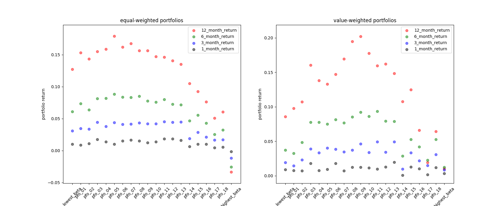

# spec-beta
Investors' disagreement and the risk-return trade-off in the Korea stock market

### Motivation
[Hong and Sraer (2016)](http://onlinelibrary.wiley.com/doi/10.1111/jofi.12431/abstract) [1](#footnote1) shows that with short-sales constraints,
> The greater divergence of opinion creates overpricing of high beta stocks compared to low beta ones [Miller (1977)](https://www.jstor.org/stable/2326520?seq=1#page_scan_tab_contents) [2](#footnote2) and [Chen et al. (2002)](https://scholar.harvard.edu/stein/publications/breadth-ownership-and-stock-returns)[3](#footnote3) . Arbitrageurs attempt to correct this mispricing but their limited risk-bearing capacity results only in limited shorting leading to equilibrium overpricing.

### Data
1. Sample period : 2009-01-01 ~ 2017.09.30
2. Sample stocks : Korea Stock Market ([KOSPI market](http://global.krx.co.kr/contents/GLB/02/0201/0201010100/GLB0201010100.jsp))
3. Data source : [DataGuide](http://www.dataguide.co.kr/DG5web/eng/index.asp)
and [Korean Statistical Information Service(KOSIS)](http://kosis.kr/eng/)

### Beta-sorted portfolios

1. **Pre-ranking betas**  Each month, estimate the market beta of each stock by regressing the past twelve months of daily *excess stock return* on *excess market return*. The regressor variable (market return) is constructed by the contemporaneous excess market return and five lags of the contemporaneous excess market returns to account for the illiquidity of small stocks.Pre-ranking beta is the sum of six ordinary least squares (OLS) coefficients.

2. **20 beta-sorted portfolios**   Sort and assign stocks every month into twenty (20) beta-sorted portfolios. Then, calculate both equal-weighted and value-weighted returns of the portfolios.

3. **Post-ranking betas**   Estimate the market beta of each portfolio by regressing daily *excess portfolio return* on *excess market return* using entire sample period. The regressor variable (market return) is constructed by the contemporaneous excess market return and five lags of the contemporaneous excess market returns to account for the illiquidity of small stocks. Post-ranking beta is the sum of six ordinary least squares (OLS) coefficients.

4. **Result**  `X-axis` represents twenty (20) beta-sorted portfolios from *the lowest beta portfolio* (left) to *the highest beta portfolio* (right). `Y-axis` represents equal-weighted and value-weighted portfolio return, in left subplot and right subplot respectively.
 

### Measuring investors' disagreement
Here I use stock analyst forecast of the earnings per share (EPS) long-term growth rate (LTG) as the main proxy for investors’ opinion about the individual stocks.

1. **Earnings per share (EPS) Long-Term Growth rate (LTG)**  Working on writing README.md...

 
 
 
 
 
 

### References
<a name="footnote1">1</a>: Hong, Harrison, and Sraer, David A., 2016, "Speculative Betas", *Journal of Finance*, October 2016, 71 (5), 2095-2144.

<a name="footnote2">2</a>: Miller, Edward M, “Risk, Uncertainty, and Divergence of Opinion,” *Journal of Finance*, September 1977, 32 (4),
1151–68.

<a name="footnote3">3</a>: Chen, Joseph, Harrison Hong, and Jeremy C. Stein, “Breadth of ownership and stock returns,” *Journal of
Financial Economics*, 2002, 66 (2-3), 171–205.
